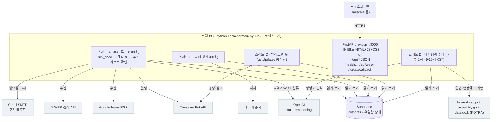
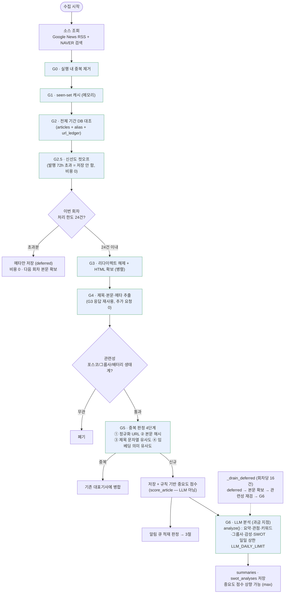
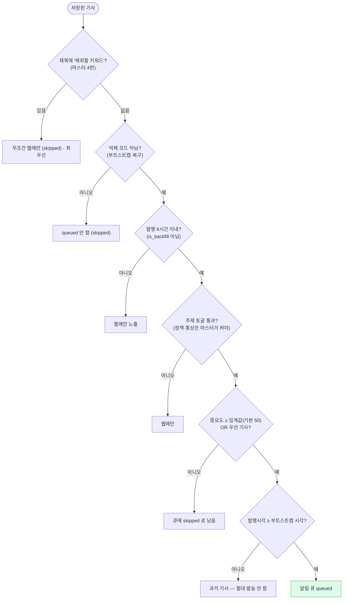
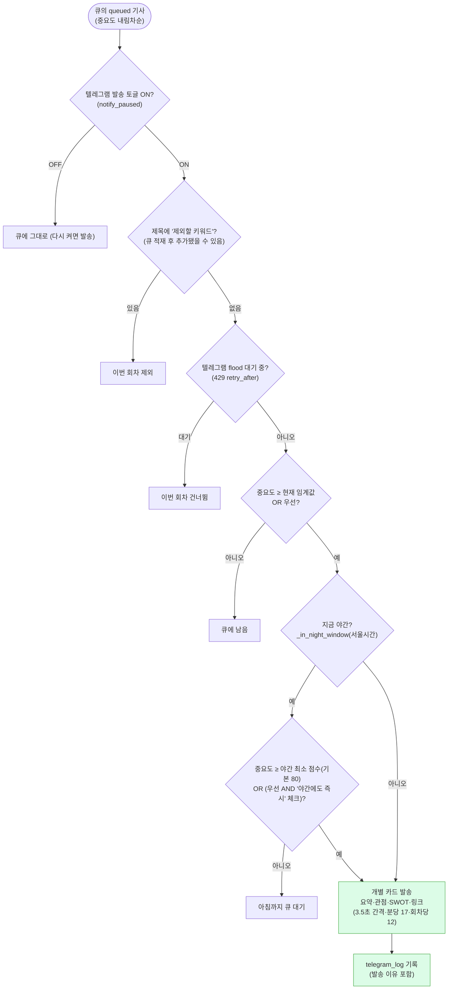
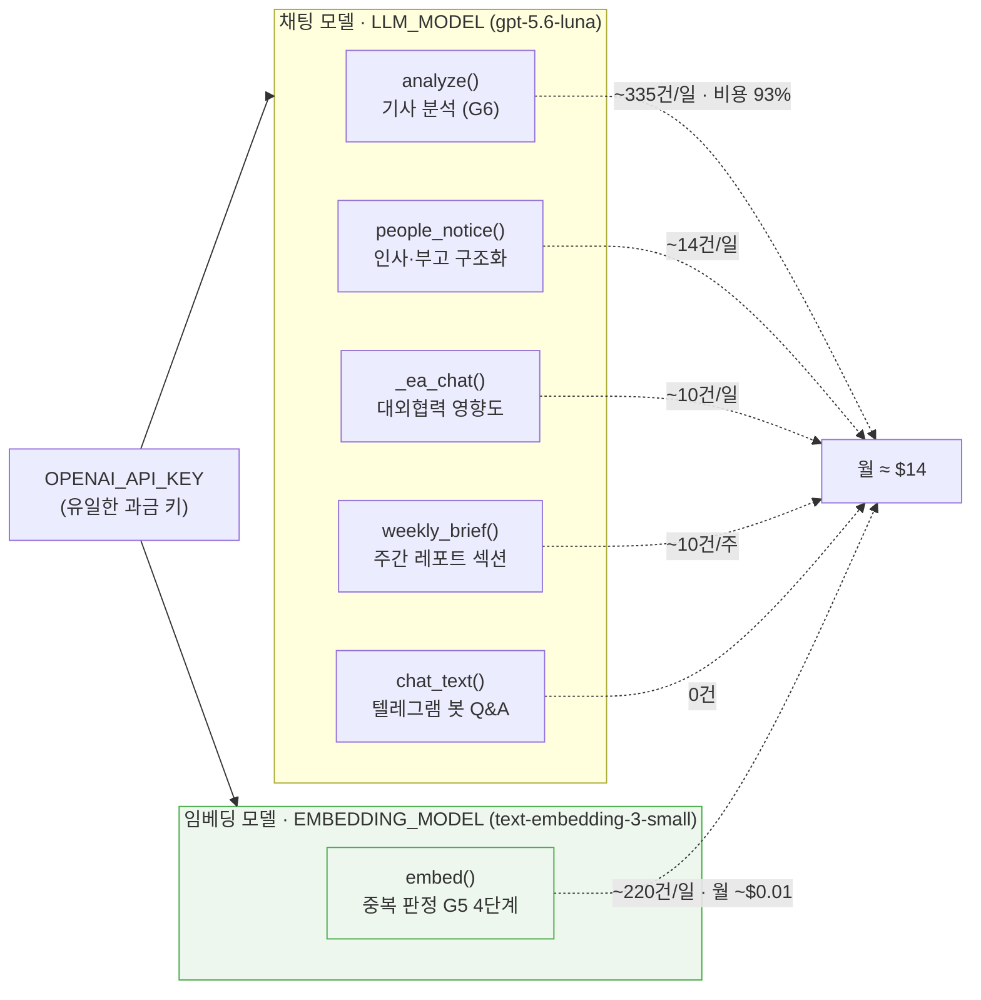
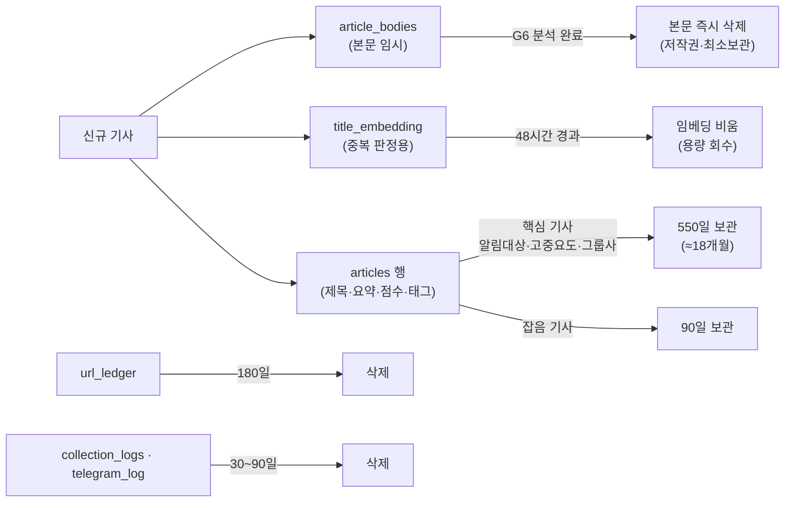
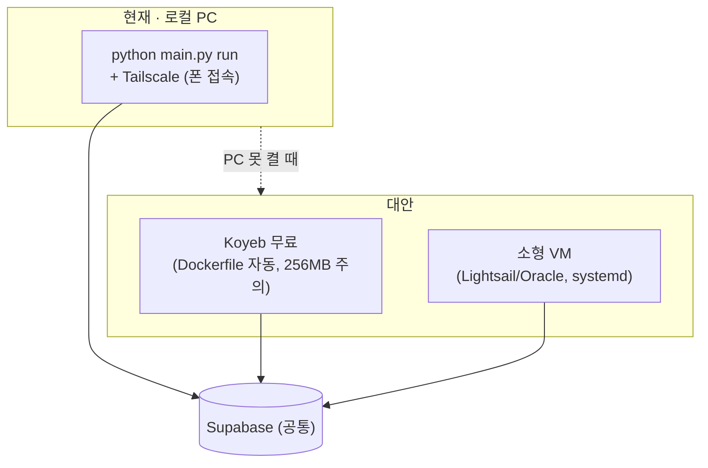

# 전체 로직 다이어그램

`backend/main.py` 한 파일의 동작을 그림으로. 상세 설명은
[ARCHITECTURE.html](ARCHITECTURE.html), 운영은 [RUNBOOK.md](RUNBOOK.md).

> GitHub 에서 이 파일을 열면 다이어그램이 렌더된다.

---

## 1. 시스템 구성 — 프로세스 1개, 스레드 4개

**핵심:** 저장소는 SQLite(로컬 개발·사내 배포) 또는 Supabase(현재), `DB_BACKEND` 로 전환.
어느 쪽이든 `Storage` ABC + 두 구현이 **동일 스키마**를 유지한다
(`schema_sqlite.sql` + `init_schema()` 의 `alter table` 리스트 ↔ `schema.sql`).
PC 프로세스는 재시작해도 잃을 게 없다. → 인스턴스는 **반드시 1개** (2개면 알림 중복).

---

## 2. 수집 파이프라인 — `run_once()` (300초마다)

**분석(G6)이 밀리거나 예산이 소진돼도** 수집·저장·알림은 계속된다. 요약·SWOT 만
빠진 채로 저장되고, 나중에 소급 분석된다. 본문은 **분석이 끝나면 즉시 삭제**.

---

## 3. 알림 판정 — 저장과 발송은 별개

### 3-1. 큐 적재 (`run_once` 안에서, 저장 직후)

- `우선 기사` = 마스터의 **무조건 받을 키워드**가 제목·판정 그룹사에 있음
  → 임계값을 우회. 야간 우회는 **'야간에도 즉시 발송' 체크**(`always_kw_bypass_night`, 기본 켜짐)가
  켜져 있을 때만 — 끄면 우선 기사도 야간엔 아침까지 대기
- `제외할 키워드` 는 임계값·우선 여부를 **모두 이긴다** — 제목에 있으면 무조건 웹에만.
  `run_once` 와 `_send_notifications` 양쪽에서 검사
- **정책·통상 주제**: ① 관심 키워드와 ② 필수 공통 키워드가 **둘 다** 매칭돼야 하고
  (한쪽이라도 비면 발송 안 함), 제목에 그 주제의 ✕ 제외 키워드가 없어야 한다

### 3-2. 실제 발송 (`_send_notifications` — 파이프라인 회차마다)

야간 창·최소 점수는 **마스터 패널 3번** 에서 조정 (`run_state`, 없으면 `.env NIGHT_*`).
최소 점수 **101** = 야간 전면 차단(우선 기사만).

---

## 4. LLM 호출 지도 — 어떤 함수가 어떤 모델을 쓰나

사내 키로 대체 시: 채팅은 `LLM_BASE_URL` 지원 추가로 라우팅 가능(코드 ~20줄),
임베딩은 별도 판단 — [RUNBOOK §3](RUNBOOK.md#3-사내-api-키로-교체-비용-절감).

---

## 5. 데이터 수명주기

Supabase 무료 500MB 한도 대비. `ARTICLE_RETENTION_DAYS` 로 조정 (늘리면 용량도 비례).

---

## 6. 배포 형태별 (참고)

Vercel·serverless 는 **불가** — 상주 스레드(수집·봇)를 못 돌린다.
자세히는 [DEPLOY.md](DEPLOY.md).
